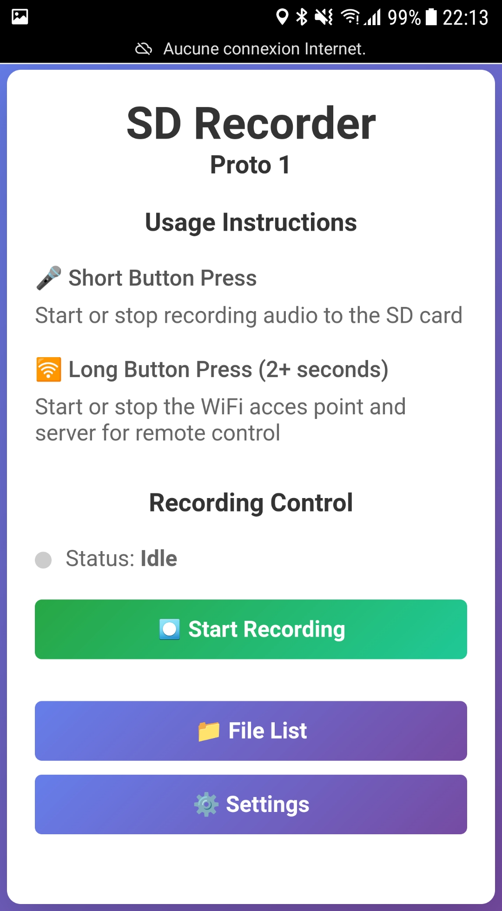
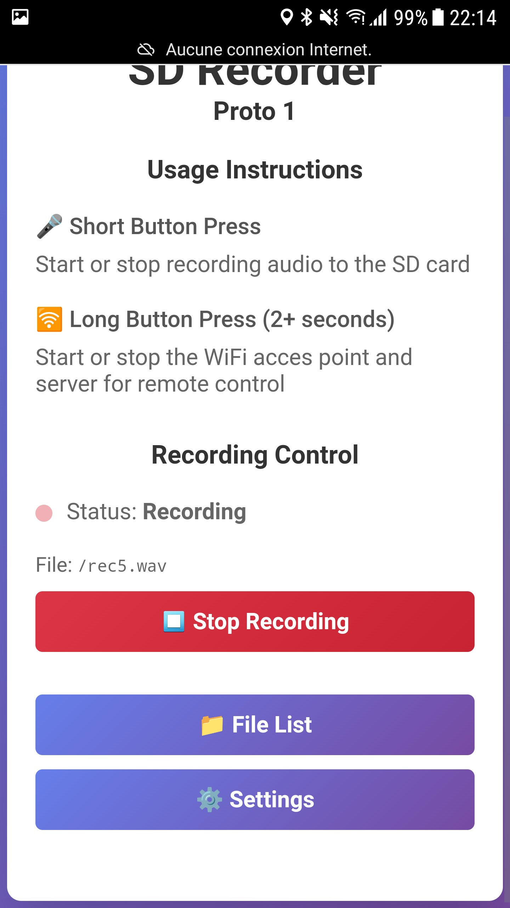
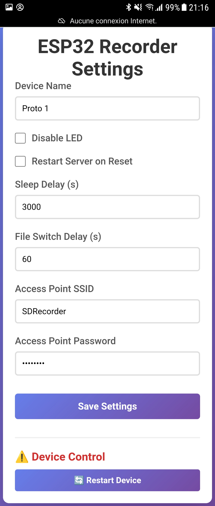
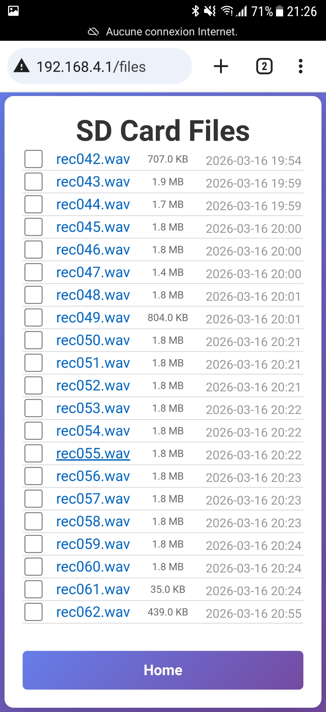

# SDRecorder

*About 90% of the code and this README was written by Claude Haiku 4.5 through GitHub Copilot, with minimal editing.*

A compact ESP32-based audio recording device with SD card storage, WiFi web interface, and power-efficient operation for portable recording applications.

## Overview

SDRecorder is a battery-powered audio recorder that captures WAV files to an SD card. The device features a simple push-button interface for recording control, an LED status indicator, and a web-based interface for settings management and file access. The design prioritizes low power consumption through intelligent sleep modes.

## Features

- **Audio Recording**: Captures audio to SD card in WAV format
- **Automatic File Rotation**: Creates new recording files at configurable intervals to optimize storage and prevent extremely large files
- **Web-Based Interface**: Access settings, view recordings, and manage files through a WiFi access point
- **Power Efficiency**: ESP32 enters light sleep mode when idle to extend battery life
- **Simple Controls**: One push button for all operations
- **Status Indicator**: LED provides visual feedback for device status
- **File Management**: Download and delete recordings directly from the web interface
- **Flexible Settings**: Configure recording intervals, WiFi credentials, sleep timing, and more

## Push Button Usage

The single push button provides three levels of interaction:

### Quick Press (< 2 seconds)
- **First press**: Start recording
- **Second press**: Stop recording
- The device immediately begins capturing audio to the SD card when recording starts

### Long Press (2+ seconds)
- **Hold for 2 seconds but less than 6**: Start the WiFi access point
- Once activated, the device creates a WiFi network you can connect to
- Default SSID and password can be configured via the web interface at http://192.168.1.4

### Very long press (6+ seconds)
- reset the ESP32

### Power Management
- When not in use, the device automatically enters light sleep mode after a configurable delay
- Pressing the button wakes the device from sleep
- This design significantly reduces battery consumption during idle periods

## LED Status Indicators

- **Slow Flash** (every 2 seconds while recording): Device is recording audio
- **Quick Flash** (continuous): SD card error - either the card is absent or cannot be written to
- **Double Blink** (on startup): System ready and waiting for input
- **Triple Blink**: Wifi Access Point and web server started or stopped

## WiFi Web Interface

When the WiFi access point is active, connect to the network and navigate to `http://192.168.1.4` to access the web interface.

### Available Pages

#### Home Page (`/`)
Main dashboard for recording control and quick status overview
- Display current recording status
- Start/stop recording controls
- Quick access to settings and file management

After pressing the "Start Recording" button:

#### Settings Page (`/settings`)
Configure device behavior and preferences:
- **File Split Interval**: Set how many seconds of recording before a new file is created
- **WiFi Credentials**: Configure the AP SSID and password
- **Sleep Timer**: Adjust the delay before the device enters sleep mode
- **Server Auto-Start**: Enable/disable WiFi server startup after device restart
- Save and apply changes to persistent storage

#### Files Page (`/files`)
Manage recorded audio files:
- View list of all recordings on the SD card with file sizes and date
- Download files directly to your mobile phone or computer
- Delete individual files or manage storage space

### API Endpoints (for advanced users)

- `GET /apis/settings` - Retrieve current settings in JSON format
- `POST /apis/settings` - Update settings
- `POST /apis/recording/start` - Start recording
- `POST /apis/recording/stop` - Stop recording
- `GET /apis/recording/status` - Get current recording status
- `POST /apis/files/delete` - Delete files
- `POST /apis/system/restart` - Restart the device
- `POST /apis/system/time` - Set the device time (accepts timestamp in JSON body)
- `GET /apis/system/time` - Get the current device time and RTC status

### Tools

A python script opens a UI allowing to select a source folder containing .wav files and stich them into one single .wav file.
This is handy in case you use the automatic file switching feature. 
Check the firmware/pc folder in this repository.

## Hardware Prototype

Here is the current prototype, awaiting PCB v1. A future v2 may feature an RGB LED for more detailed status indication.

