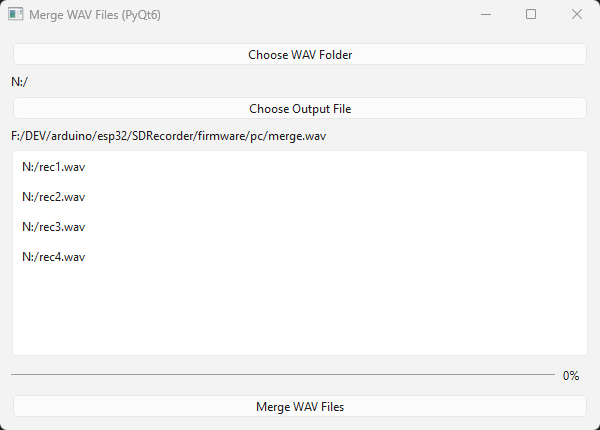

# .wav file merger

The mergeWav.py is a python script you can use to merge the .wav files produced by the SDRecorder.

When recording, the SDRecorder switches to a new file every X minutes (1 minute for now, this will be an accessible parameter soon-ish), so that not much recording is lost when the battery charge is too low to power the device.

This python script with a simple GUI allows to stitch them easily.

