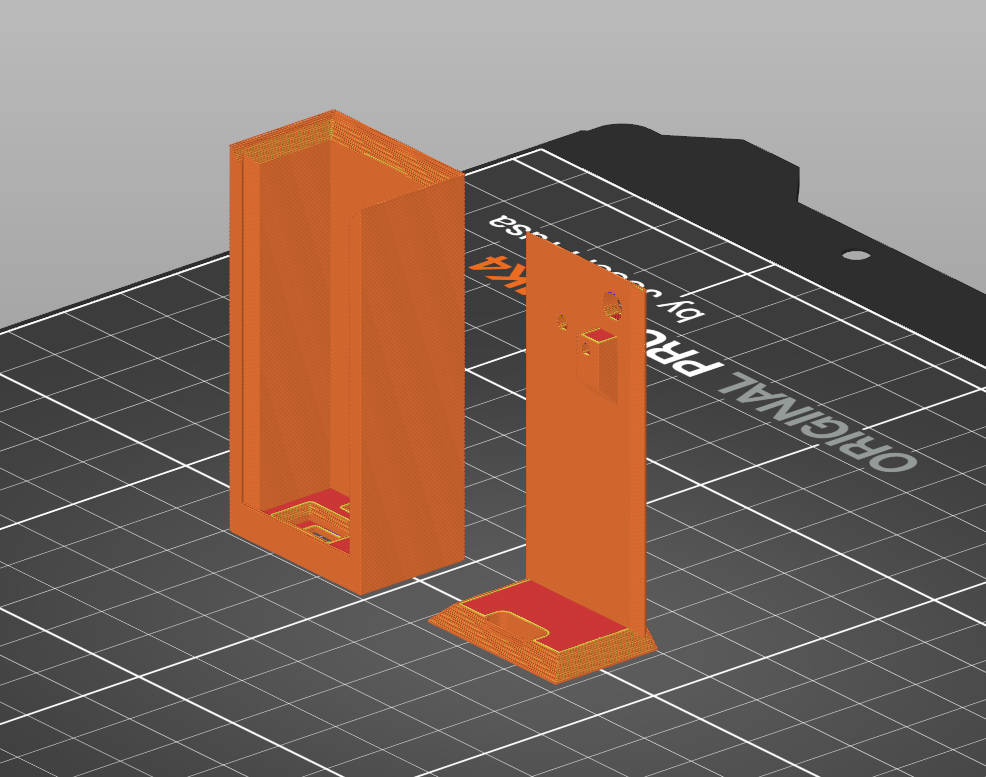
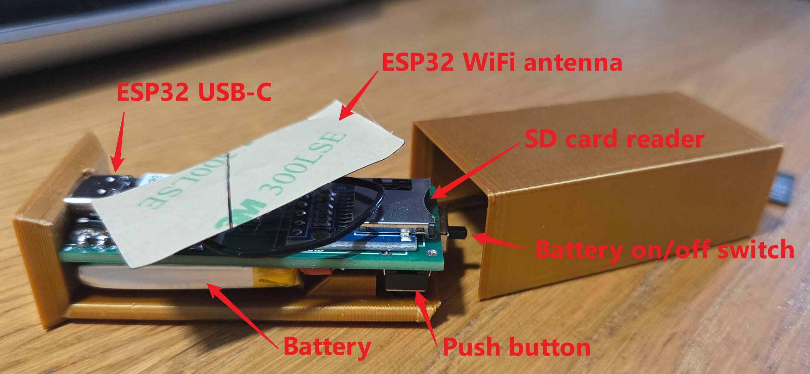
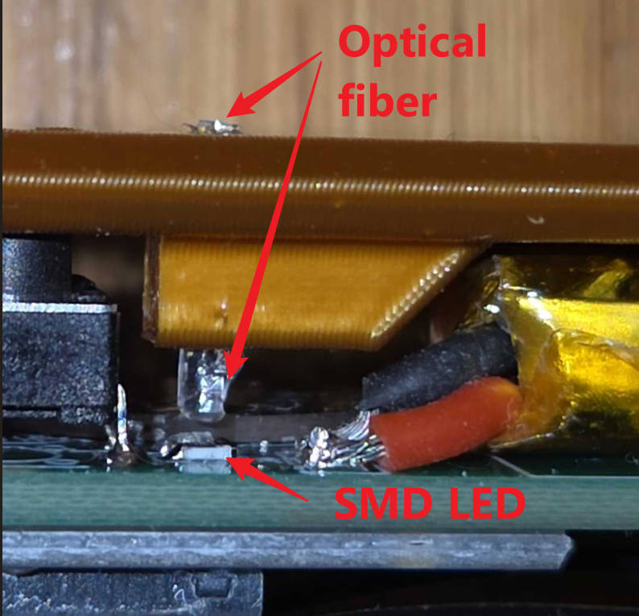
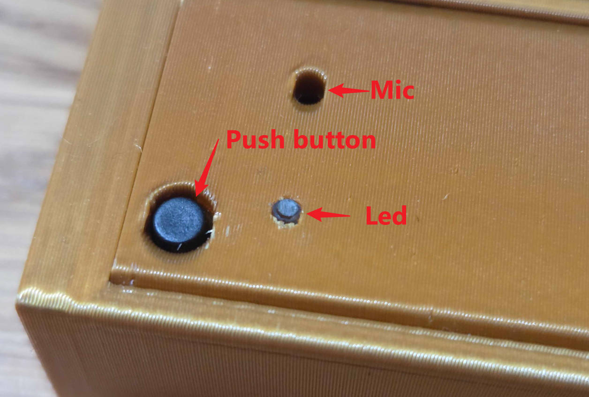

# Case

Both parts should be printed vertically.

 

Assemble flat: put the bottom part on a table, then insert the USB-C in its slot while making sure the push button is going through the hole.

Then slide the top case close slowly, making sure the antenna is not squeezed at the USB extremity.

 

Push a little bit of optical fiber down the led hole (about 5mm should do).

 

And enjoy.

 

