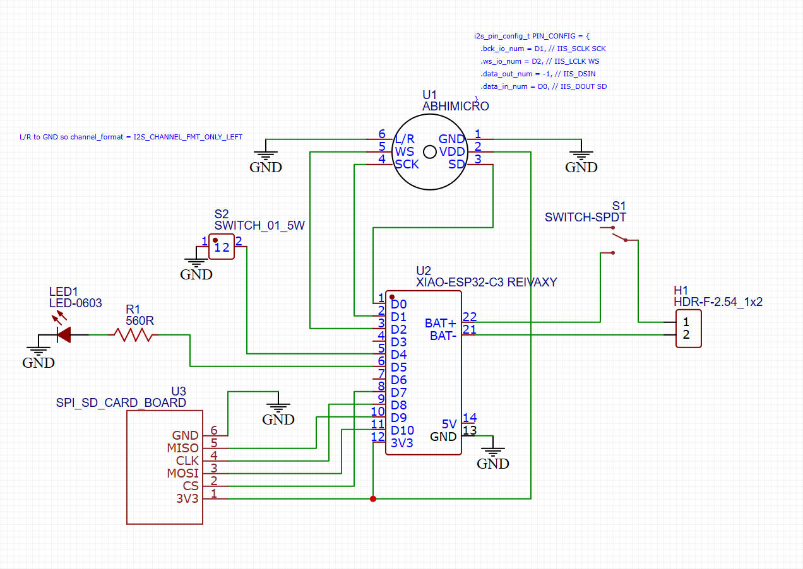
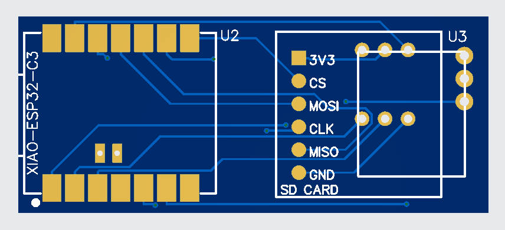
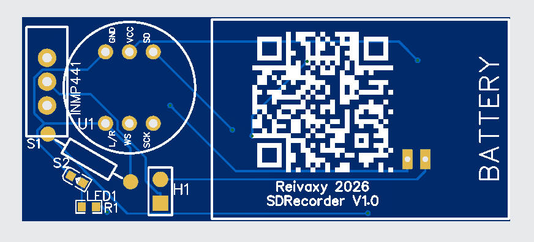

# PCB Manufacturing

This PCB can be easily manufactured and ordered through online PCB services such as JLCPCB, PCBWay, or similar providers.

Version 1 is a bit buggy but can work.

The push button print is not right for the push button I had in stock, and the microphone board needs to be mounted on pins. Next version should take care of this and maybe accomodate several push buttons sizes.

## How to Order

Simply upload the Gerber files to your chosen PCB manufacturer's website. The Gerber files contain all the necessary information for fabrication including traces, layers, holes, and other manufacturing specifications.

## Schematics

## PCB Views

Dimensions: 51.9 mm* 21.7 mm

Top side

Bottom side

